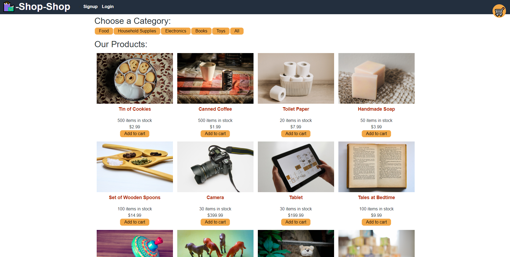
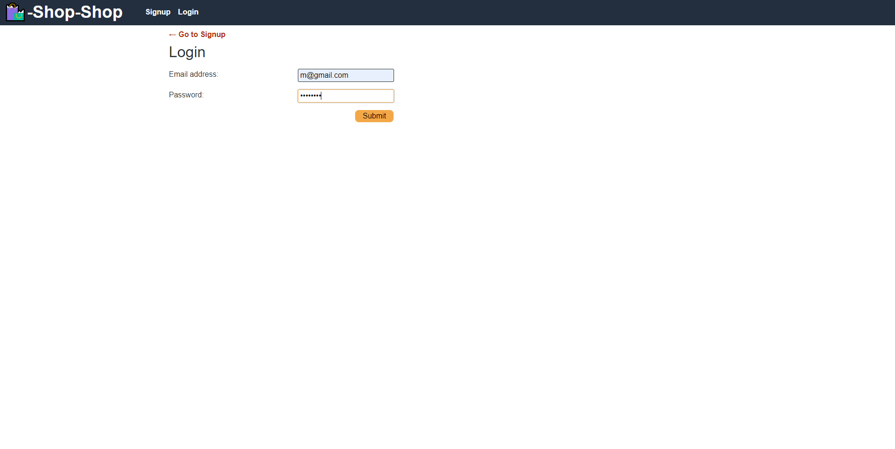
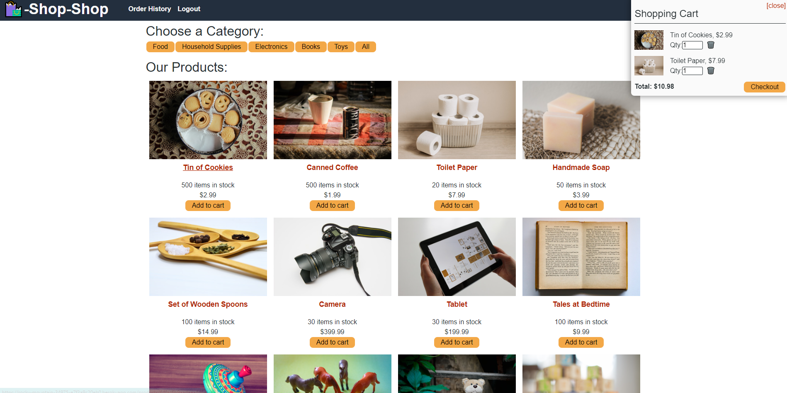
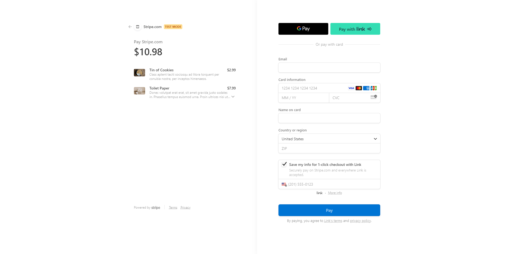
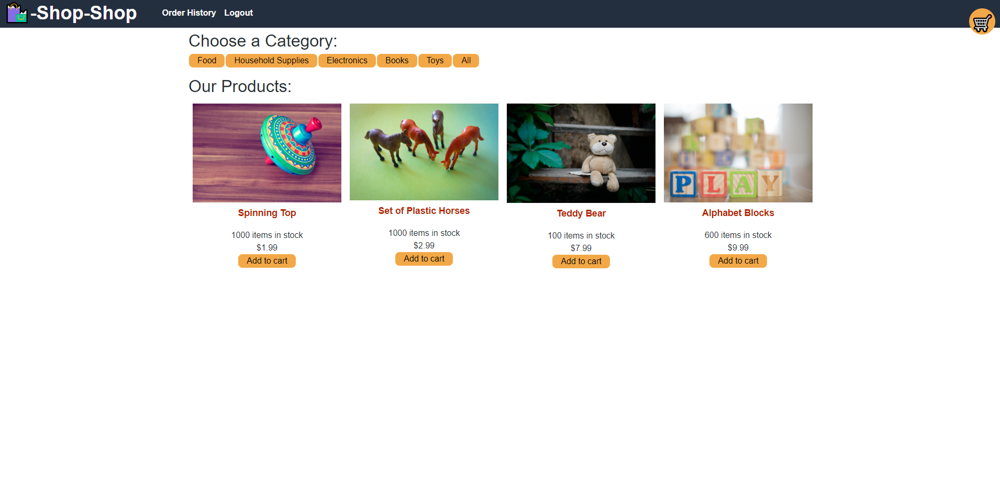
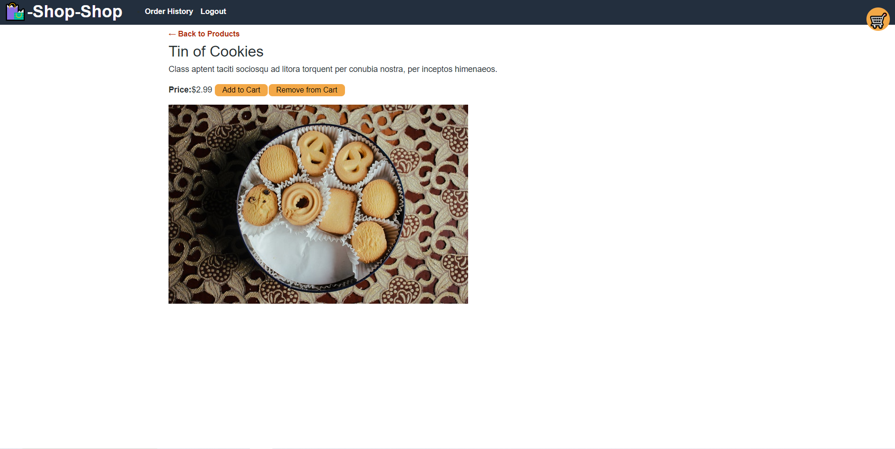

# redux-store

## Description

This project was built to function as an ecommerce website where users can purchase products, sign up/log in to an account, and checkout securely. It was built using Redux to manage global state, instead of React's Context API.

## Table of Contents

- [Usage](#usage)
- [Credits](#credits)

## Usage

This is the homepage users are brought to when visiting the website link. It presents users with products, a signup/login button, and cart.

In order to check out products, users must create an account or log in to an existing one.

Once logged in, users can see the checkout button after adding items to their cart, where they are also presented with the option to remove items.

After clicking the checkout button, users are redirected to a checkout page where they can securely put in their information to purchase items.

Users can also view products by category. In this picture, we chose the "Toys" category to view all the items in that category.

Users can also click on an item to view it in more detail with a description. If the item is already in the cart, there is also a button to remove it from the cart within the card.

## Credits

* BCS Learning Assistant Jerromy Chance
* https://react-redux.js.org/api/hooks